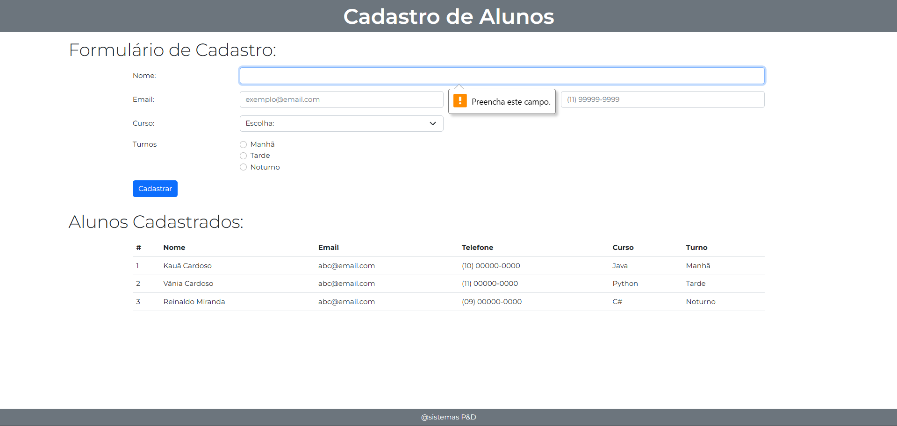
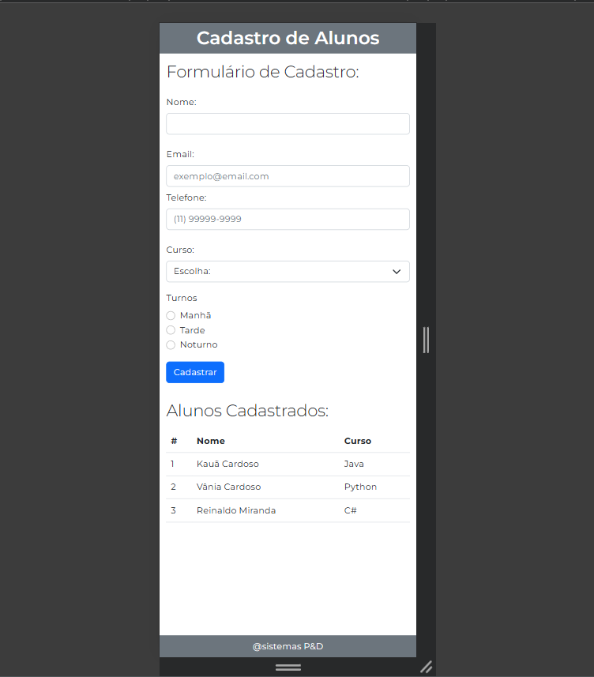

# BootCamp - Module 5 Student Registration 🚀
Project for module progression. Improving HTML, JavaScript &amp; BootStrap. The project must follow the following example images:
  - [Desktop Version](https://github.com/kauanzin222/bootcamp-devjr-modulo5-cadastro-aluno/blob/main/imagesEx/desktop.png) 🖥️
  - [Mobile Version](https://github.com/kauanzin222/bootcamp-devjr-modulo5-cadastro-aluno/blob/main/imagesEx/mobile.png) 📱

--- 
## Final Result: 

### - Desktop: 
 

### - Mobile: 
